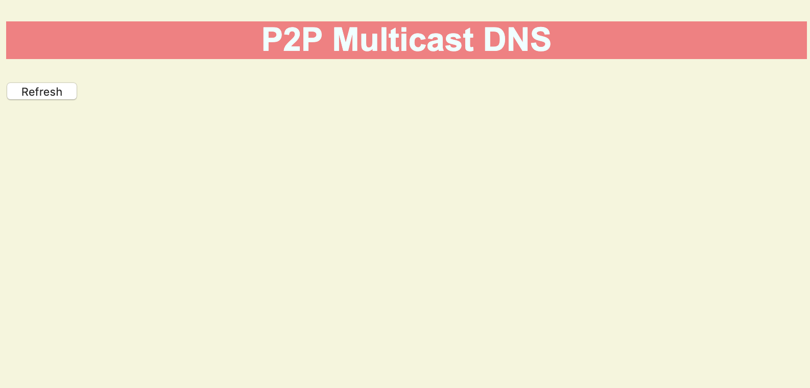

# p2p-mDNS

This is a peer-to-peer app to show the presence of other peers via mDNS in a local network. This app was developed with [Electron](https://electronjs.org/). 
You can see below a screenshot of the application.

Follow the instructions below to start the app:

1. Clone this repository in your desired directory

2. Make sure you have installed Node.js, if not, download it: https://nodejs.org/en/download/

3. Install Electron with the command: npm install --save-dev electron

5. Install all the packages, which are defined in package.json, with the command: npm install

4. Start the app with: npm start

To work on this repository, you can use any editor or IDEs, which supports JavaScript. I prefer to work with WebStorm from Jetbrains: https://www.jetbrains.com/webstorm/.
